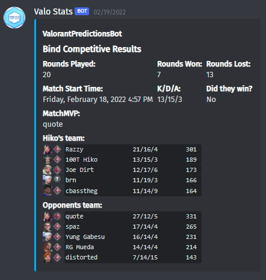

# ValorantPredictionsBot
A simple Twitch/Discord bot which can grab the stats most commonly used for Twitch predictions on Valorant games.

# Credits
[Henrik-3](https://github.com/Henrik-3) for his [unofficial valorant api](https://github.com/Henrik-3/unofficial-valorant-api)

# Future plans
In the future, the hope is this bot will be able to end a prediction and also give the correct result so the viewers can have a seamless experience and not get scammed by Pepega mods, unfortunatly the Twitch API does not yet cover predictions so I would please ask anyone interested to vote on [this](https://twitch.uservoice.com/forums/310213-developers/suggestions/41966401-api-support-for-predictions) Twitch discussion board and hopefully twitch will release an API ASAP.

# Usage

1. Install the requirements with pip
```
pip install --user -r requirements.txt
```

2. Create a basic bot instance for either Twitch, and/or Discord, you can use Google for this.

3. Rename and edit sample.env to config.env with the bots credentials, and set the preferred platform you wish to use.

4. Find the players Username, Region and PUUID you wish to use and input them in the correct env vars.

5. Finally once the config is setup and finished, run the bot with:

```
python3 -m PredictionsBot
```

# Examples
## Twitch


## Discord
